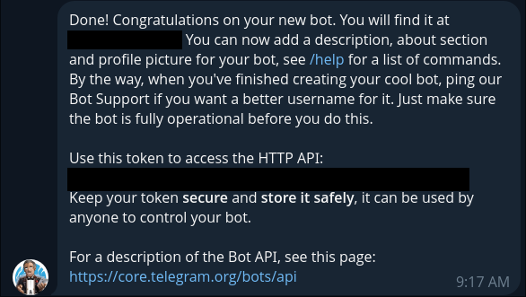
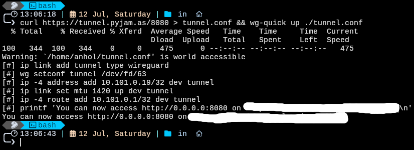

# ytm_dl_bot for Telegram
 Telegram bot that allows you to download music from YouTube Music for free without Google account or YTP

## **Running it locally:**
### 1. Requirements:
* ### Install these tools:
    * [Node.js](nodejs.org/en)  
    * [yt-dlp](https://github.com/yt-dlp/yt-dlp)
    * [ffmpeg](https://ffmpeg.org/)  for Windows, Mac or Linux with codec for mp3 (Lavf61.7.100)
    * http server (you can use `npx http-server`)
    * [wg-quick from WireGuard](https://www.wireguard.com/install/)
    * [pyjam](https://tunnel.pyjam.as/) for exposing 8080 port to the external computers (Telegram servers in this case)

### 2. Getting everythig to run
1. Go to the Telegram and find @BotFather bot
2. Create new bot with `/newbot` command. Give it name and everything that bot asks for. </br> It will give you the **token** that you will need later. The message will look like this:
    
3. Run `git clone https://github.com/L0calho5t/ytm_dl_bot.git && cd ytm_dl_bot`
3. Run `npm install` to install all needed dependences
5. Create `.env` file to hold your BotFather token
6. Add the following to the file: `TOKEN="<Your token>"`</br> and replace `<Your token>` with token provided by the BotFather in step 2
7. Go to the *img-music-tmp* folder and run `npx http-server`. If the package is not installed - npx will offer you to install it. Do it.
8. Go to another terminal session and type </br> ```curl https://tunnel.pyjam.as/8080 > tunnel.conf && wg-quick up ./tunnel.conf ``` to forward yout 8080 port through pyjam servers and to allow connections from external computers. </br> Output will look like this: 
9. In `.env` file add URL value and then write the url that pyjam gave you </br> Example `.env` file: 
    ```
    TOKEN="example:1234567890abcdefghijklm"
    URL="https://example.tunnel.pyjam.as/"
    ```
10. To run the bot execute `npm start` in the project directory
11. Enjoy free music im mp3 format downloaded directly to Telegram

## **Roadmap:**
* [X] Download songs from YouTube Music with metadata and thumbnails
* [ ] Inline mode for downloading songs that are already downloaded on the server
* [ ] Music forwarding to your playlists in Telegram
* [ ] Docker support for running bot in one click